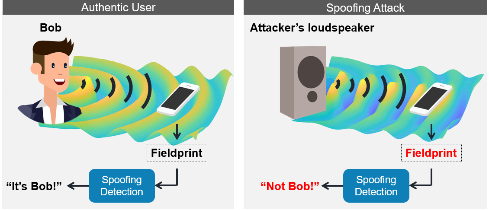
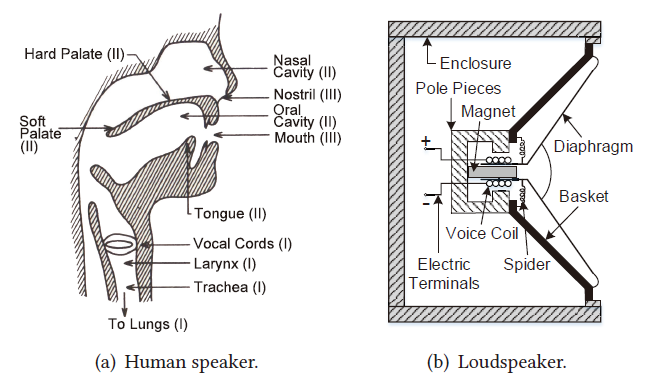
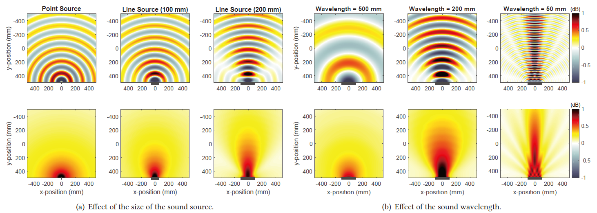
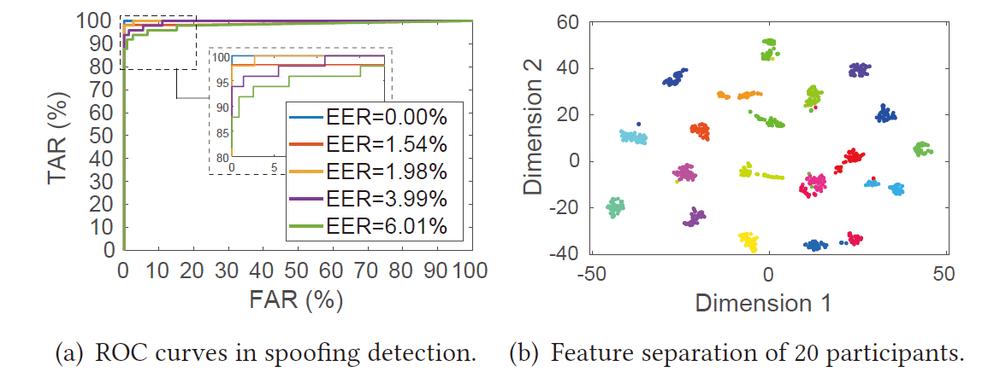

# What is CaField?

Verifying the identity of voice inputs is important as voices are increasingly used for sensitive operations. Traditional methods focus on differentiating individuals via the spectrographic features of voices (e.g., voiceprint), yet cannot cope with spoofing attacks, whereby a malicious attacker synthesizes the voice with almost the same voiceprint of a victim or simply replays it. This paper proposes CaField, a text-independent speaker verification method to detect loudspeaker-based voice spoofing attacks with the goal of achieving two seemingly conflicting requirements: usability and security. The key insight of CaField is to construct “fieldprint” with the acoustic biometrics embedded in sound fields, i.e., a physical field of acoustic energy created as the sound propagates over the air, as analogous to “voiceprint”. We find that fieldprints can be distinctive between speakers (either humans or loudspeakers), and thus we may detect the speakers being used for spoofing attacks from the authentic users.

## How does CaField work?



​                            **Figure 1:  An illustration of utilizing sound fields to detect loudspeakers-based spoofing attacks with a smartphone.** 

​                                                                       

# Background

## Human and loudspeakers 

Human vocal tract and loudspeaker rely on distinct sound production mechanisms.



​                                                                         **Figure 2: A sectional view of a human vocal tract and a loudspeaker.**

## Sound fields

The directivity of a sound field is affected by both the sound source and the generated sound, while larger size of the sound source and higher frequency of the sound wavelength mean more directional.



​                         **Figure 3: A 2-D simulation of sound fields in the air (on the 1st row) and their directivity patterns (on the 2nd row).** 

# Threat Model

We aim to detect the spoofing attacks on text-independent speaker verification systems. An adversary may apply the following three types of attacks:

- *Replay*. An adversary acquires voice samples of the target user through eavesdropping, public speech, etc., and replays the voice samples with loudspeakers.
- *Speech synthesis*. An adversary synthesizes utterances in the voice of the target user from text input using speech synthesize technologies and plays with loudspeakers.
- *Voice conversion*. An adversary converts a human utterance into the voice of the target user and plays with loudspeakers.

# Overview of CaField


​                                                                  **Figure 4: A modular representation of CaField**

# Performance

Our evaluation on a dataset of 20 people and 8 loudspeakers shows that by relying on two on-board microphones to sample sound fields while users talk to the smartphones, CaField achieves a detection accuracy of 99.16% and an equal error rate (EER) of 0.85% across multiple sessions and various voice inputs. CaField supports low audio sample rates at 8 kHz and is robust to various factors including phone displacement, user posture, recording environment, etc.

​                                                                                                     **Table 1: The overall performance of CaField**

|         **Function**         | **Accuracy** | **FAR** | **FRR** | **EER** |
| :--------------------------: | :----------: | :-----: | :-----: | :-----: |
|   Detect spoofing attacks    |    99.16%    |  0.82%  |  0.97%  |  0.85%  |
| Differentiate human speakers |    98.42%    |  1.87%  |  1.43%  |  1.84%  |




​                   **Figure 5:  The ROC curves of 5 participants in spoofing detection and the distinctive features of 20 participants with t-SNE.**

# Read Our paper

Yan C, Long Y, Ji X, et al. The catcher in the field: A fieldprint based spoofing detection for text-independent speaker verification[C]//Proceedings of the 2019 ACM SIGSAC Conference on Computer and Communications Security. 2019: 1215-1229. [[pdf](https://dl.acm.org/doi/pdf/10.1145/3319535.3354248)]

# Citation

```
@inproceedings{yan2019catcher,
  title={The catcher in the field: A fieldprint based spoofing detection for text-independent speaker verification},
  author={Yan, Chen and Long, Yan and Ji, Xiaoyu and Xu, Wenyuan},
  booktitle={Proceedings of the 2019 ACM SIGSAC Conference on Computer and Communications Security},
  pages={1215--1229},
  year={2019}
}
```

# Contact
* Prof. Wenyuan Xu (<wyxu@zju.edu.cn>)
* Prof. Xiaoyu Ji (<xji@zju.edu.cn>)
* Dr. Chen Yan(yanchen@zju.edu.cn)

# Powered by

<table bgcolor="white">
<tr valign="middle">
<td width="50%" align="center" colspan="2">
 <a href="http://usslab.org">Ubiquitous System Security Laboratory (USSLab) 
</td>
<td width="50%" align="center" colspan="2">
  <a href="http://www.zju.edu.cn/english">Zhejiang University 
</td>
</tr>
<tr valign="middle">
<td width="50%" align="center" colspan="2">
  <a href="http://usslab.org"></a>
  <a href="http://usslab.org"></a>
</td>
<td width="50%" align="center" colspan="2">
  <a href="http://www.zju.edu.cn/english/"></a>
  <a href="http://www.zju.edu.cn/english/"></a>
</td>
</tr>
</table>